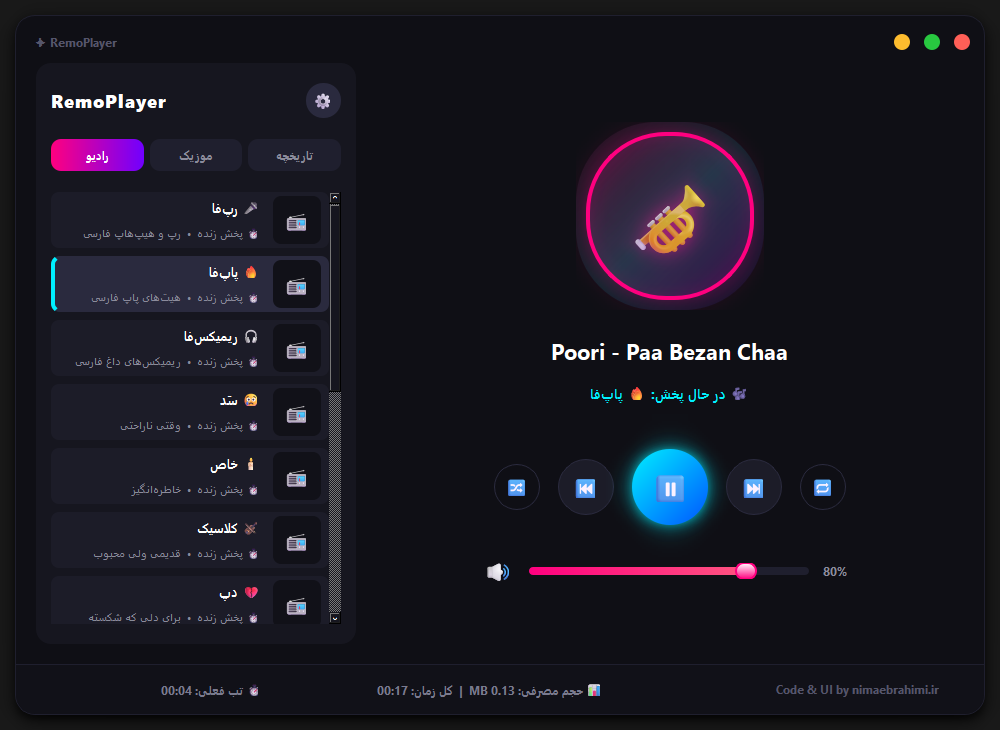

<div align="center">

# 🎧 RemoPlayer

### پلیر رادیو و موزیک برای ویندوز



[](https://github.com/nima-globals/RemoPlayer/releases/latest/download/RemoPlayer.exe)
[](https://github.com/nima-globals/RemoPlayer/releases)
[](LICENSE)

</div>

---

## 🗒️ درباره RemoPlayer

ریمو پلیر یک برنامه دسکتاپ برای ویندوز است که دو نیاز رایج را در یک رابط ساده و شیک کنار هم می‌آورد: گوش دادن به ایستگاه‌های رادیوی اینترنتی و پخش فایل‌های موزیکی که روی سیستم‌تان ذخیره کرده‌اید. برنامه از موتور پخش قدرتمند VLC استفاده می‌کند، به همین دلیل تقریباً هر فرمت صوتی رایج را بدون دردسر پخش می‌کند. علاوه بر پخش ساده، ریمو پلیر با یکپارچگی کامل با ویجت مدیای ویندوز، اعلان لحظه‌ای تغییر آهنگ، تاریخچه پخش، پشتیبانی از پروکسی و آمار مصرف، یک تجربه‌ی یکپارچه و حرفه‌ای برایتان می‌سازد.

---

<div align="center">

## ⬇️ دانلود مستقیم

### <a href="https://github.com/nima-globals/RemoPlayer/releases/latest/download/RemoPlayer.exe">📥 دانلود RemoPlayer.exe</a>

فایل بالا را از صفحه‌ی [Releases](https://github.com/nima-globals/RemoPlayer/releases) دانلود کنید و مستقیماً اجرا کنید — نیازی به نصب پایتون نیست.
تنها پیش‌نیاز، نصب بودن **[VLC Media Player](https://www.videolan.org/vlc/)** روی سیستم شماست؛ همین برنامه موتور پخش صدای RemoPlayer را فراهم می‌کند.

</div>

---

## ✨ امکانات

- 📻 **رادیوی اینترنتی** — به ده‌ها ایستگاه رادیویی آنلاین گوش دهید یا ایستگاه‌های دلخواه خودتان را با وارد کردن آدرس استریم اضافه و مدیریت کنید.
- 🎵 **پخش موزیک لوکال** — فایل‌های `.mp3`، `.wav`، `.flac` و `.ogg` را از هر پوشه‌ای پخش کنید؛ برنامه به‌طور خودکار کاور آلبوم، نام خواننده و آلبوم را نمایش می‌دهد و یک نوار پیشرفت برای جابه‌جایی سریع در آهنگ در اختیارتان می‌گذارد.
- 🪟 **یکپارچگی با ویجت مدیای ویندوز (SMTC)** — عنوان آهنگ، نام خواننده و کاور آلبومی که در حال پخش است، درست مثل پلیرهای بومی ویندوز، در ویجت مدیای بالای Notification Center نمایش داده می‌شود و دکمه‌های Play/Pause/Stop — از جمله کلیدهای مدیای روی کیبورد — به‌درستی کار می‌کنند.
- 🔔 **اعلان هوشمند ویندوز** — هر بار که ایستگاه رادیویی به آهنگ جدیدی سوییچ می‌کند، یک نوتیفیکیشن ویندوزی دریافت می‌کنید تا همیشه بدانید الان چه چیزی در حال پخش است.
- 📜 **تاریخچه پخش** — برنامه به‌طور خودکار فهرستی از تمام آهنگ‌ها و ایستگاه‌هایی که گوش داده‌اید نگه می‌دارد تا هر وقت خواستید بتوانید به آن‌ها برگردید.
- 🌐 **پشتیبانی از پروکسی** — در صورت نیاز، استریم‌ها را از طریق پروکسی HTTP یا SOCKS5 عبور دهید.
- 🚀 **اجرای خودکار هنگام روشن شدن ویندوز** — به‌صورت اختیاری، RemoPlayer را طوری تنظیم کنید که همزمان با بالا آمدن ویندوز خودش اجرا شود.
- 📊 **آمار مصرف** — تخمین زنده‌ای از حجم اینترنت مصرف‌شده و مدت‌زمانی که گوش داده‌اید مشاهده کنید.

---

## 🛠️ اجرا از سورس

اگر می‌خواهید برنامه را از روی کد منبع اجرا کنید، پیش‌نیازها این‌هاست: ویندوز ۱۰ یا ۱۱، پایتون ۳.۱۰ به بالا و نصب بودن [VLC Media Player](https://www.videolan.org/vlc/).

```bash
git clone https://github.com/nima-globals/RemoPlayer.git
cd RemoPlayer
pip install -r requirements.txt
python main.py
```

---

## ⚙️ تنظیمات

تمام تنظیمات برنامه — از جمله ایستگاه‌های رادیو، پوشه موزیک، پروکسی، اعلان‌ها و اجرای خودکار — از طریق دیالوگ ⚙️ داخل خود برنامه قابل مدیریت است و در مسیر زیر ذخیره می‌شود:

```
%APPDATA%\RemoPlayer\config.json
```

---

<div align="center">

MIT License © 2026 [Nima Ebrahimi](https://nimaebrahimi.ir)

</div>
